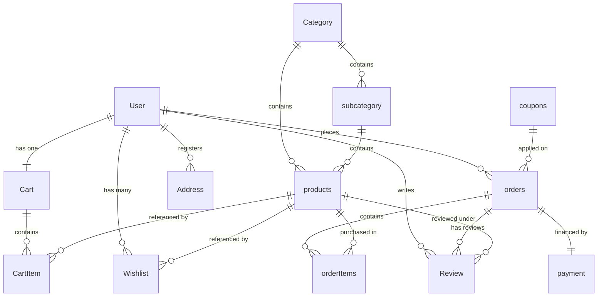

# E-Commerce Backend API Engine

A secure, high-performance, and scalable RESTful API built with **Node.js**, **Express.js**, and **Sequelize ORM** mapped to a **MySQL** database. This backend powers the entire E-Commerce demo application, supporting features like user authentication, role-based access control, shopping cart & wishlist management, product cataloging, reviews, coupons, dynamic order tracking, Razorpay payment processing, and automatic database seeding.

---

## 🚀 Key Features

*   **Secure Authentication**: Standard signups, logins, secure JWT access tokens & refresh tokens, password hashing with `bcryptjs`, and cookie-based storage.
*   **Email Verification & Password Reset**: Automated OTP generation, email verification, and password recovery via `nodemailer`.
*   **Role-Based Access Control (RBAC)**: Fine-grained access level restriction (`admin` vs. `user`) implemented via middleware.
*   **Product Catalog Management**: Structured schemas for **Categories**, **Subcategories**, and **Products** with image uploads handled via `multer`.
*   **Shopping Cart & Wishlist**: Dynamic cart calculations, item quantities, and a persistent wishlist with database integrity.
*   **Reviews & Ratings**: Customer feedback loop with ratings and detailed reviews linked to specific products and verified orders.
*   **Order & Checkout System**: Custom checkout validator (`Joi`), subtotal/tax/delivery calculation, coupon adjustments, and order state transition tracking (`pending`, `packing`, `shipping`, `delivered`, `completed`, `cancelled`).
*   **Razorpay Payment Integration**: Integrated payment verification flows (order generation, client key endpoints, and secure signature checking).
*   **Google Maps Integration**: Maps API implementation for geolocating and verifying shipping/user addresses.
*   **Keep-Alive & Connection Resiliency**: Dialect connection retries for database dropouts and a periodic 4-minute keep-alive ping.

---

## 🛠️ Technology Stack

*   **Runtime Environment**: Node.js (v16.x or higher recommended)
*   **Backend Framework**: Express.js (v5.x)
*   **Database Engine**: MySQL
*   **Object-Relational Mapping (ORM)**: Sequelize (v6.x)
*   **Data Validation**: Joi (v18.x)
*   **Image Processing**: Multer (v2.x)
*   **Payment Services**: Razorpay Node SDK (v2.x)
*   **Mailing System**: Nodemailer (v8.x)

---

## 🗃️ Database Architecture

Below is the database relationship schema mapping designed with Sequelize.



---

## 📁 Repository Structure

```text
backend/
├── config/             # DB connection, Razorpay, and Email configurations
├── controllers/        # Express request handlers & core business logic
│   ├── ADMIN/          # Controllers for admin dashboard operations
│   └── USER/           # Controllers for user shopfront activities
├── docs/               # Technical documents & API specs (if any)
├── middelware/         # Custom Express middlewares (auth, upload, validation)
├── models/             # Database models defined via Sequelize Schemas
│   ├── ADMIN/          # Schemas for Admin models (Categories, Products, etc.)
│   └── USER/           # Schemas for User models (Cart, Address, Order, etc.)
├── public/             # Static file storage (e.g. uploaded images in uploads/)
├── routes/             # Express routes maps mapping URLs to controllers
│   ├── ADMIN/          # Routes restricted to Admin users
│   └── USER/           # Routes accessible by authenticated Users
├── utils/              # Utility helper modules (file systems, response helpers)
├── validators/         # Joi validation schemas for incoming request body sanitization
├── .env                # Local environmental secrets and system configs
├── seed_products.js    # Data seeding script to populate Categories and Products
├── server.js           # Server bootstrapper and application entry point
└── package.json        # Project metadata, dependencies, and execution scripts
```

---

## ⚙️ Local Installation & Setup

Follow these steps to run the backend engine on your machine:

### 1. Prerequisites
Make sure you have installed:
*   [Node.js](https://nodejs.org/) (v16+)
*   [MySQL Server](https://www.mysql.com/) running locally or hosted

### 2. Clone and Navigate
```bash
git clone <your-repository-url>
cd backend
```

### 3. Install Dependencies
```bash
npm install
```

### 4. Setup Environment Variables
Create a file named `.env` in the root of the `backend` directory (referencing the configuration format below):

```ini
# Database Connection Details
DB_HOST=localhost
DB_PORT=3306
DB_USER=your_db_user          # e.g., root
DB_PASS=your_db_password      # e.g., secret
DB_NAME=ecommerce             # The database must be created in MySQL first

# Token Secrets for Encryption
JWT_SECRET=your_jwt_access_secret_key
REFRESH_SECRET=your_jwt_refresh_secret_key

# Nodemailer SMTP Email Configs (for OTP dispatch)
MY_EMAIL=your_sending_email@gmail.com
MY_PASSWORD=your_app_specific_email_password

# Razorpay Integration keys (Sandbox/Live)
RAZORPAY_KEY_ID=rzp_test_XXXXXXXXXXXXXXXX
RAZORPAY_KEY_SECRET=XXXXXXXXXXXXXXXXXXXXXXXX
RAZORPAY_WEBHOOK_SECRET=XXXXXXXXXXXXXXXXXXXXXXXXXXXXXXXXXXXXXXXX

# Maps API credentials
GOOGLE_MAPS_API_KEY=AIzaSyXXXXXXXXXXXXXXXXXXXXXXXXXXXXXXXX
```

### 5. Synchronize Database & Seed Initial Products
Ensure your MySQL server is running, and create a database named `ecommerce` (or whatever you set in `DB_NAME`).

Then run the seed script to automatically connect to the database, sync tables, and populate it with categories, subcategories, and dummy products:
```bash
node seed_products.js
```

### 6. Start the Server
Start the development server with hot-reloading (via `nodemon`):
```bash
npm run dev
```
The server will sync models and begin listening on the configured port (default is `5000`):
```text
Database connected successfully
Orders status ENUM updated successfully in database
Database synchronized successfully
Server is running on port 5000
```

---

## 🔌 API Endpoints Reference

### 🔐 Authentication & User Accounts
| Method | Endpoint | Access / Role | Description |
| :--- | :--- | :--- | :--- |
| **POST** | `/auth/register` | Public | Registers a new user account |
| **POST** | `/auth/login` | Public | Validates credentials and returns JWT + Refresh Token |
| **POST** | `/auth/logout` | Public | Logs out user and clears sessions |
| **POST** | `/auth/refresh-token` | Public | Generates a new access token using a valid Refresh Token |
| **POST** | `/auth/forgot-password` | Public | Submits user email and dispatches OTP code |
| **POST** | `/auth/verify-otp` | Public | Verifies OTP correctness |
| **POST** | `/auth/reset-password`| Public | Replaces the password once OTP verification succeeds |
| **GET** | `/auth/all-users` | Admin | Fetches list of all registered users |
| **POST** | `/auth/user` | Admin | Direct creation of user accounts with profile photo |
| **GET** | `/auth/user/:id` | Admin | Retrieves details of a specific user |
| **PUT** | `/auth/user/:id` | Admin / User | Updates user profile details & profile image |
| **DELETE** | `/auth/user/:id` | Admin | Deletes user from system |

### 🗂️ Categories & Subcategories
| Method | Endpoint | Access / Role | Description |
| :--- | :--- | :--- | :--- |
| **GET** | `/categories` | Public | Retrieves all active categories |
| **GET** | `/categories/:id` | Public | Retrieves specific category details |
| **POST** | `/categories` | Admin | Creates a new category with uploadable banner/image |
| **PUT** | `/categories/:id` | Admin | Updates category details & image |
| **DELETE** | `/categories/:id`| Admin | Deletes category and cascading sub-elements |
| **GET** | `/subcategories` | Public | Retrieves all subcategories |
| **GET** | `/subcategories/:id` | Public | Retrieves specific subcategory details |
| **POST** | `/subcategories` | Admin | Creates a new subcategory under a category with image |
| **PUT** | `/subcategories/:id`| Admin | Updates subcategory metadata & image |
| **DELETE** | `/subcategories/:id`| Admin | Deletes subcategory |

### 🏷️ Products Catalog
| Method | Endpoint | Access / Role | Description |
| :--- | :--- | :--- | :--- |
| **GET** | `/products` | Public | Fetches products list (supports filters/categories) |
| **GET** | `/products/:id` | Public | Fetches individual product details by ID |
| **POST** | `/products` | Admin | Creates product with metadata, stock inventory, and image |
| **PUT** | `/products/:id` | Admin | Edits product credentials and stock levels |
| **DELETE** | `/products/:id` | Admin | Removes product listing from catalog |

### 🛒 Shopping Cart & Wishlist
| Method | Endpoint | Access / Role | Description |
| :--- | :--- | :--- | :--- |
| **GET** | `/cart` | User | Retrieves user's active shopping cart & item subtotals |
| **POST** | `/cart/add/:id` | User | Adds a product to user's cart (or increments quantity) |
| **PUT** | `/cart/update/:id` | User | Updates item quantity inside the cart |
| **DELETE** | `/cart/remove/:id` | User | Removes an item from the cart |
| **GET** | `/wishlist` | User | Lists all products bookmarked in user's wishlist |
| **POST** | `/wishlist/add/:id` | User | Toggles adding a product to the user's wishlist |
| **DELETE** | `/wishlist/remove/:id`| User | Deletes a product from the wishlist |

### 📍 Addresses
| Method | Endpoint | Access / Role | Description |
| :--- | :--- | :--- | :--- |
| **GET** | `/address` | Admin / User | Retrieves saved billing/shipping addresses |
| **GET** | `/address/:id` | Admin / User | Fetches specific address by ID |
| **POST** | `/address` | Admin / User | Appends a new delivery address with geocoordinates |
| **PUT** | `/address/:id` | Admin / User | Modifies saved address properties |
| **DELETE** | `/address/:id` | Admin / User | Deletes address entry |

### 💳 Checkout, Orders, & Coupons
| Method | Endpoint | Access / Role | Description |
| :--- | :--- | :--- | :--- |
| **POST** | `/checkout` | User | Validates cart, processes address, applies coupons, locks price |
| **GET** | `/orders` | User | Lists order history for logged-in user |
| **GET** | `/orders/track/:id`| User | Inspects status and items of a specific order |
| **GET** | `/orderstatus` | Admin | Lists all client orders placed on the platform |
| **PUT** | `/orderstatus/:id` | Admin | Updates order delivery/packaging state |
| **DELETE** | `/orderstatus/:id` | Admin | Cancels and removes order records |
| **GET** | `/coupon` | Public | Retrieves valid promotional codes |
| **POST** | `/coupon` | Admin | Registers a new promotional coupon code with guidelines |
| **PUT** | `/coupon/:id` | Admin | Edits coupon availability and discount factors |
| **DELETE** | `/coupon/:id` | Admin | Invalidates/Deletes coupon codes |
| **POST** | `/coupon/apply` | User | Validates coupon string against current checkout totals |

### 💰 Razorpay Payments Gateway
| Method | Endpoint | Access / Role | Description |
| :--- | :--- | :--- | :--- |
| **GET** | `/payment/key` | User | Returns the Razorpay Merchant Public Key for UI initialization |
| **POST** | `/payment/create-order`| User | Initiates Razorpay payment order registry with billing total |
| **POST** | `/payment/verify-payment`| User | Checks cryptographic signature to confirm transaction success |
| **GET** | `/payment` | Admin | Lists all payment receipts in database |
| **DELETE** | `/payment/:id` | Admin | Removes transaction history log |

### ⭐ Reviews & Feedback
| Method | Endpoint | Access / Role | Description |
| :--- | :--- | :--- | :--- |
| **GET** | `/review/product/:productId`| Public | Fetches all user reviews and aggregate ratings for a product |
| **GET** | `/review/user` | User | Lists all reviews written by the active user |
| **POST** | `/review` | User | Submits review text and rating for an order-verified product |
| **PUT** | `/review/:id` | User | Edits review content |
| **DELETE** | `/review/:id` | User | Removes review |
